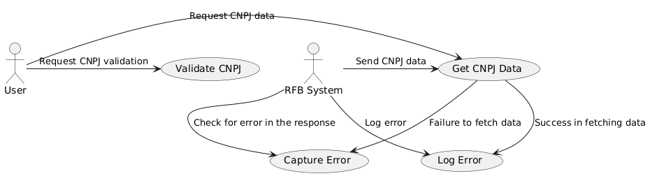
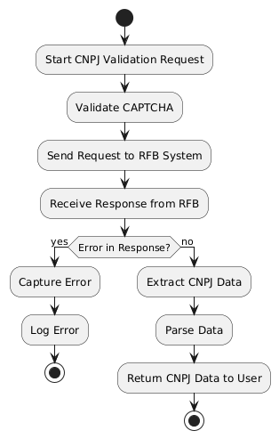
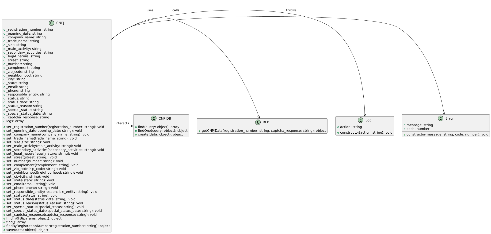
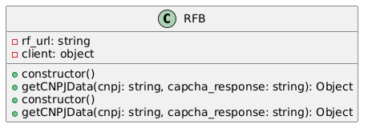
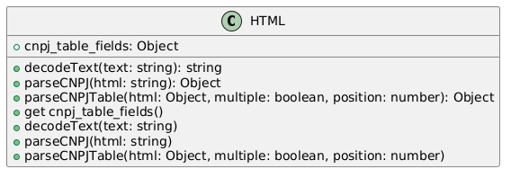
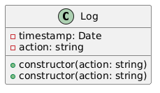
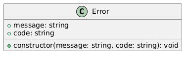
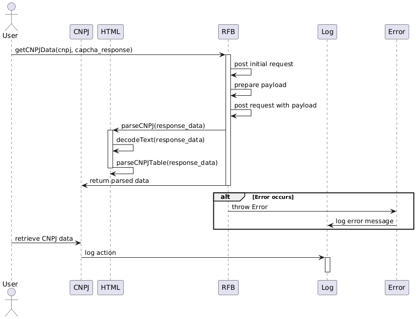

# Visão Geral dos Diagramas

## 1. Diagrama de Casos de Uso

Este diagrama mostra as interações entre o sistema e seus usuários ou sistemas externos, delineando a funcionalidade central do sistema.

## 2. Diagrama de Atividade

Este diagrama demonstra o fluxo de atividades ou processos dentro do sistema, mostrando como diferentes ações ou etapas estão interconectadas.

## 3. Diagrama de Classes CNPJ

Este diagrama representa a estrutura das classes relacionadas ao CNPJ, mostrando como elas são organizadas e interagem no sistema.

## 4. Diagrama de Classes RFB

Este diagrama foca nas classes relacionadas às interações com a Receita Federal (RFB), particularmente como o sistema lida com a recuperação e validação de dados do RFB.

## 5. Diagrama de Classes HTML

Este diagrama mostra como o sistema processa e estrutura os dados HTML, que são essenciais para fazer o parsing das informações relacionadas ao CNPJ.

## 6. Diagrama de Classes Log

Este diagrama ilustra como o mecanismo de logs funciona, registrando e gerenciando entradas de log para ações e erros do sistema.

## 7. Diagrama de Classes de Erro

Este diagrama descreve como os erros são tratados no sistema, fornecendo uma estrutura para gerenciar mensagens e códigos de erro.

## 8. Diagrama de Sequência

Este diagrama mostra como as interações entre os objetos ocorrem ao longo do tempo, detalhando o fluxo de mensagens e operações entre eles.
