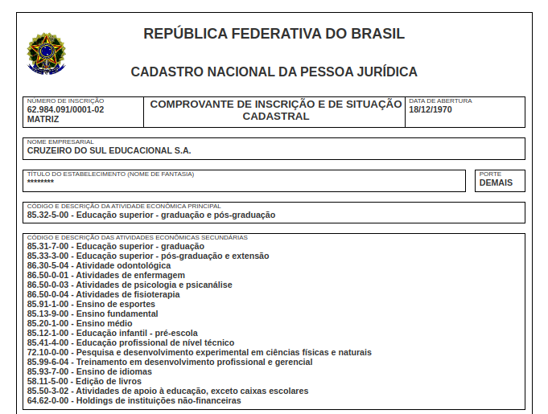
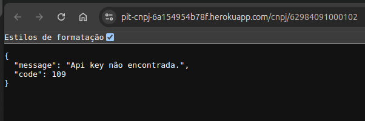

# Laudo de Qualidade do Sistema

**Data:** 01/12/2024  
**Responsável pela análise:** Equipe de Testes  

---

## Resumo

O sistema foi submetido a testes para verificar a funcionalidade, confiabilidade e segurança de suas principais features. Os testes foram realizados por diferentes analistas, com foco em cinco funcionalidades principais: consulta de CNPJ, integração com a Receita Federal, retorno de captcha, autenticação via API Key e suporte a CORS.  

O sistema apresentou um desempenho funcional satisfatório em todas as funcionalidades testadas, sem falhas relatadas. Evidências foram coletadas e anexadas para respaldar os resultados.  

---

## Funcionalidades Testadas

### 1. **Integração com a Receita Federal**
- **Tester:** DANIEL MOTA  
- **Resultados:**
  - **O que funcionou:** A consulta de CNPJ retornou dados fidedignos da Receita Federal.  
  - **Erros identificados:** Nenhum.  
  - **Evidências:**  
      
      

---

### 2. **Consultar CNPJ**
- **Tester:** CLEBER OLIVEIRA  
- **Resultados:**
  - **O que funcionou:** A recuperação de dados de consultas anteriores foi bem-sucedida, sem necessidade de resolução de captcha.  
  - **Erros identificados:** Nenhum.  
  - **Evidências:**  
      

---

### 3. **Retorno do Captcha**
- **Tester:** LUIZ SILVA  
- **Resultados:**
  - **O que funcionou:** O captcha da Receita Federal foi retornado corretamente para o usuário.  
  - **Erros identificados:** Nenhum.  
  - **Evidências:**  
      

---

### 4. **Restrição de Acesso por API Key**
- **Tester:** JOÃO PEDRO  
- **Resultados:**
  - **O que funcionou:** A autenticação por API Key foi validada com sucesso, garantindo acesso restrito.  
  - **Erros identificados:** Nenhum.  
  - **Evidências:**  
      

---

### 5. **Suporte a CORS**
- **Tester:** ANDERSON SANTOS  
- **Resultados:**
  - **O que funcionou:** A API restringiu o acesso a domínios autorizados, conforme esperado.  
  - **Erros identificados:** Nenhum.  
  - **Evidências:**  
      

---

## Conclusão

Após a realização dos testes, o sistema demonstrou ser funcional e confiável, com todas as funcionalidades principais operando conforme o esperado.  

### Recomendações:
- Realizar testes adicionais em cenários de carga e estresse para avaliar o desempenho sob alto volume de requisições.  
- Manter monitoramento contínuo para identificar eventuais falhas em produção.  

---

**Aprovado por:**  
*Equipe de Qualidade do Software*  

