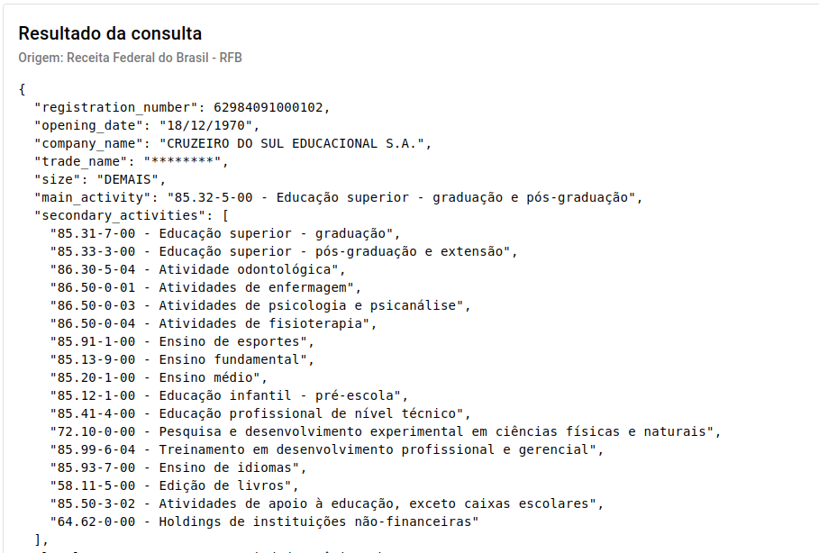
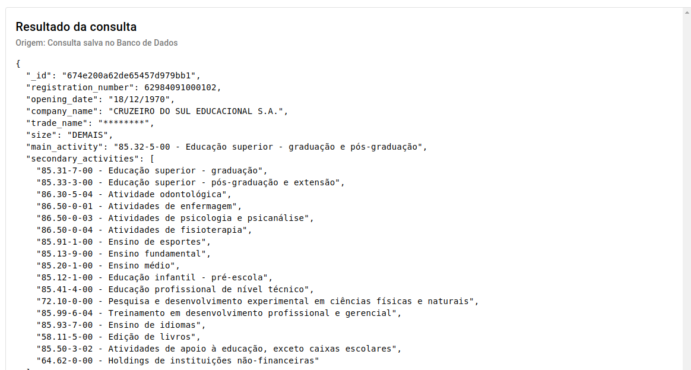
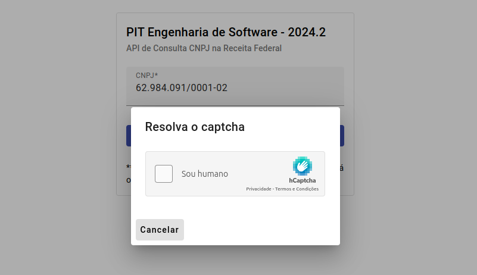

# Relatório de Testes de Funcionalidades

---

## 1. Integração com a Receita Federal do Brasil

- **Nome:** DANIEL MOTA  
- **Data do teste:** 01/12/2024  
- **O que testou e funcionou:** A consulta do CNPJ resultou dados fidedignos da Receita Federal.
- **O que testou e não funcionou – O que deve ser corrigido:** Não houve falhas nas funcionalidades testadas.
- **Funcionalidade não testada (faltou ou não foi implementada):** Dentro da proposta do serviço, a API é funcional.

**Retorno da API:**  

**Dados da Receita Federal:**  

---

## 2. Consultar CNPJ

- **Nome:** CLEBER OLIVEIRA  
- **Data do teste:** 01/12/2024  
- **O que testou e funcionou:** A recuperação de dados de consultas anteriores funciona e reduz o tempo na consulta, além de não necessitar da resolução do captcha.
- **O que testou e não funcionou – O que deve ser corrigido:** Todas as funcionalidades testadas funcionaram.
- **Funcionalidade não testada (faltou ou não foi implementada):** Não houve.

**Retorno da consulta realizada no Banco de Dados da API**  

---

## 3. Retorno do Captcha para o Usuário

- **Nome:** LUIZ SILVA  
- **Data do teste:** 01/12/2024  
- **O que testou e funcionou:** O retorno do captcha da Receita Federal para o usuário funcionou perfeitamente.
- **O que testou e não funcionou – O que deve ser corrigido:** Todas as funcionalidades testadas funcionaram.
- **Funcionalidade não testada (faltou ou não foi implementada):** Não houve, a solução é funcional.

**Retorno do captcha para o usuário:**  

---

## 4. Restrição de Acesso por API Key

- **Nome:** JOÃO PEDRO  
- **Data do teste:** 01/12/2024  
- **O que testou e funcionou:** Autenticação através de API KEY.
- **O que testou e não funcionou – O que deve ser corrigido:** Não houve.
- **Funcionalidade não testada (faltou ou não foi implementada):** API é funcional e segura.

**Erro ao tentar acessar a API sem informar a API Key:**  

---

## 5. Suporte a CORS

- **Nome:** ANDERSON SANTOS  
- **Data do teste:** 01/12/2024  
- **O que testou e funcionou:** A API KEY é restrita ao domínio associado, não sendo possível acessar a API de domínio diverso aos permitidos.
- **O que testou e não funcionou – O que deve ser corrigido:** A funcionalidade funciona perfeitamente.
- **Funcionalidade não testada (faltou ou não foi implementada):** Não houve.

**Erro ao tentar acessar a API de outro domínio:**  

---

